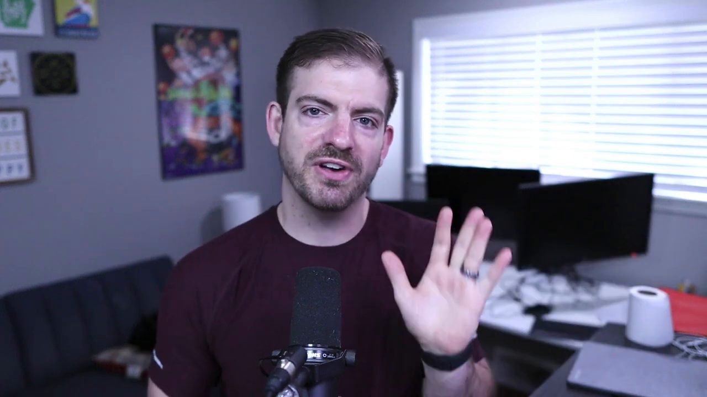

# jqq-freezeframe-util

Utility for grabbing random frames from James Q Quick's videos. It's far from perfect, but it should work (most of the time).



## Setup

Clone this repository

```
git clone https://github.com/maciejpedzich/jqq-freezeframe-util.git
```

Download [handpicked JQQ video files](https://drive.google.com/file/d/1tE4PcYrSe35RjCSg2n-xpKHl-rFj-Jd3/view?usp=sharing) and extract the `videos` folder to project's root directory.

Now `cd` into that same folder, run `npm install` and `node index.js`.

## Changes

See: `CHANGELOG.md`
